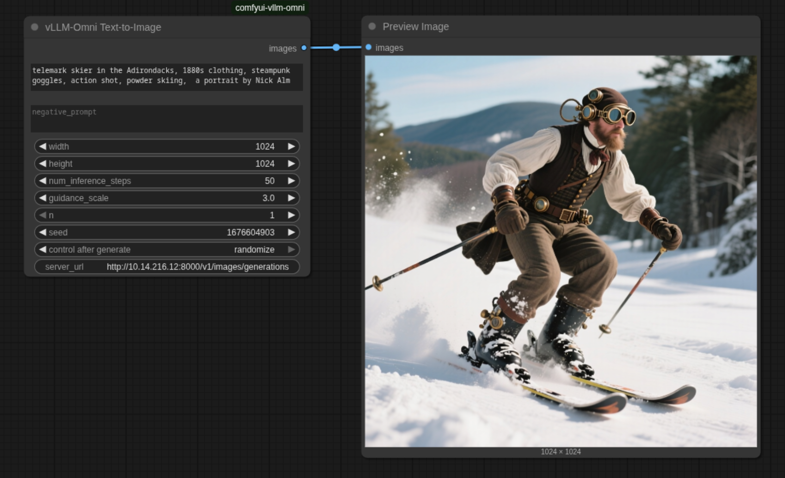
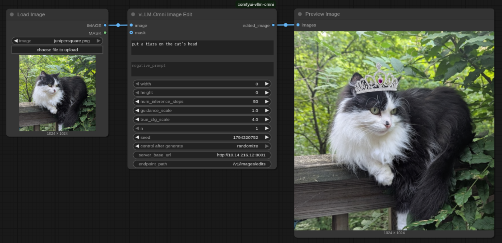
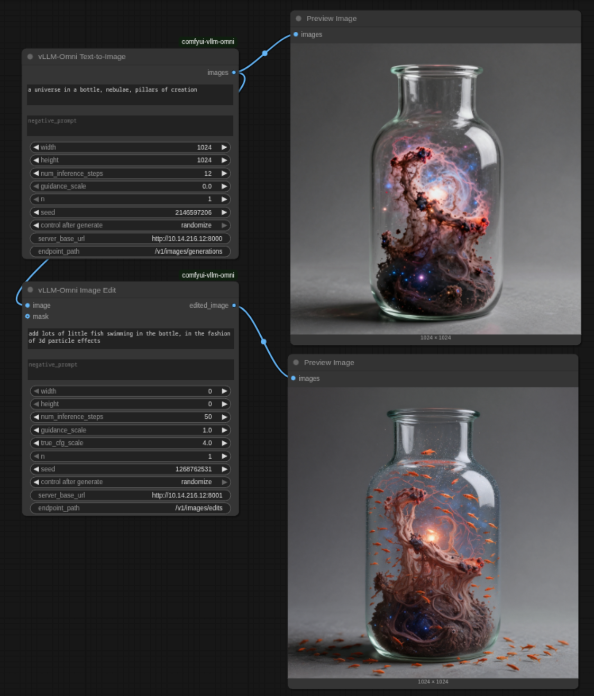

# ComfyUI-vLLM-Omni

**Official reference implementation** for ComfyUI integration with vLLM-Omni's DALL-E compatible image generation API.

Custom ComfyUI nodes that enable **text-to-image generation** and **image editing** using **vLLM-Omni's official diffusion API**. This integration allows you to use vLLM-Omni's image capabilities (Qwen-Image, Z-Image-Turbo, etc.) directly within ComfyUI workflows.


*Example: "telemark skier in the Adirondacks, 1880s clothing, steampunk goggles, action shot, powder skiing, a portrait by Nick Alm"*

## Features

### Text-to-Image Generation
- **Official vLLM-Omni DALL-E API**: Uses the official OpenAI-compatible API
- **Model Presets**: Quick-select optimal settings for Qwen-Image, Z-Image-Turbo, and more
- **Server Defaults**: Use -1 for parameters to let server choose optimal values
- **Advanced Parameters**: true_cfg_scale, VAE slicing/tiling for memory optimization
- **Full Parameter Control**: Adjust width, height, steps, guidance scale, seed
- **Negative Prompts**: Guide what NOT to generate
- **Batch Generation**: Generate multiple images in a single request

### Image Editing
- **Edit existing images** with text prompts
- **Auto size calculation** from input image aspect ratio
- **Batch variations**: Generate multiple edited versions
- **Mask support** for future inpainting capabilities
- **Advanced CFG controls** with dual guidance scales

### General
- **Async HTTP**: Non-blocking network calls for better performance
- **ComfyUI Native**: Integrates seamlessly with ComfyUI's node graph system
- **Flexible server configuration**: Split base URL and endpoint path for easier setup

## Model Presets

The node includes built-in presets for popular vLLM-Omni diffusion models:

| Preset | Inference Steps | Guidance Scale | Best For |
|--------|----------------|----------------|----------|
| **Server Default (Recommended)** | server default | server default | Let server decide (safest option) |
| **Qwen-Image (Quality)** | 50 | 4.0 | High quality, detailed images |
| **Z-Image-Turbo (Speed)** | 9 | 0.0 | Fast generation, good quality |
| **Custom** | manual | manual | Full manual control |

**How it works:**
- Select a preset from the dropdown to auto-populate parameters
- Presets only affect parameters still at default (-1 = server default)
- Manual adjustments override preset values
- "Server Default" relies on server-side model configuration (safest, always works)

**Example:** Select "Z-Image-Turbo" → steps auto-set to 9, guidance to 0.0

## Requirements

- **ComfyUI** installed and running
- **Python 3.9+**
- **vLLM-Omni** with official image generation API support
  - Install: `pip install vllm-omni` (0.6.0+)
  - Or build from source: [vLLM-Omni GitHub](https://github.com/vllm-project/vllm-omni)
- Dependencies (most already included with ComfyUI):
  - `aiohttp>=3.8.0`
  - `torch>=2.0.0`
  - `pillow>=9.0.0`
  - `numpy>=1.21.0`

## Installation

### Step 1: Install the Custom Node

Clone this repository into your ComfyUI `custom_nodes` directory:

```bash
cd ComfyUI/custom_nodes
git clone https://github.com/yourusername/comfyui-vllm-omni.git
cd comfyui-vllm-omni
pip install -r requirements.txt
```

### Step 2: Start vLLM-Omni Image Server

You need a running vLLM-Omni server with image generation support:

```bash
# Qwen-Image (quality)
vllm serve Qwen/Qwen-Image --omni --port 8000

# Z-Image-Turbo (speed)
vllm serve Tongyi-MAI/Z-Image-Turbo --omni --port 8000
```

**Note:** The default server URL in the node is `http://localhost:8000/v1/images/generations`.

### Step 3: Restart ComfyUI

Restart ComfyUI to load the new custom node.

## Usage

### Basic Workflow

1. **Add the Node**: In ComfyUI, right-click → Add Node → image/generation/vllm-omni → **vLLM-Omni Text-to-Image**

2. **Configure Parameters**:
   - **prompt** (required): Describe what you want to generate
   - **negative_prompt** (optional): Describe what to avoid
   - **width** / **height**: Image dimensions (default: 1024x1024)
   - **num_inference_steps**: Denoising steps (default: 50)
   - **guidance_scale**: CFG scale (default: 4.0)
   - **n**: Number of images to generate (default: 1)
   - **seed**: Random seed for reproducibility (0 = random)
   - **server_url**: vLLM-Omni endpoint URL

3. **Connect Output**: Connect the IMAGE output to other nodes (e.g., SaveImage, PreviewImage)

4. **Queue Prompt**: Generate your images!

### Example Prompts

```
Positive: "a majestic dragon flying over snow-capped mountains at sunset, highly detailed, 4k"
Negative: "blurry, low quality, distorted, ugly"
```

```
Positive: "a cute robot reading a book in a cozy library, warm lighting, illustration style"
Negative: "dark, scary, realistic"
```

## Example Workflows

Ready-to-use workflow examples are provided in the `examples/` folder. You can drag and drop these JSON files into ComfyUI to get started quickly.

### Available Examples

1. **`vllm-omni basic t2i.json`** - Basic text-to-image generation
   - Simple workflow showing the vLLM-Omni Text-to-Image node
   - Generates: "astronaut riding a horse on the moon"
   - Uses: Qwen-Image or Z-Image-Turbo model

2. **`vllm-omni image edit.json`** - Image editing workflow
   - Load an image and edit it with text prompts
   - Example: "put a tiara on the cat's head"
   - Shows auto size calculation (width=0, height=0)

   

3. **`vllm-omni text to image plus edit.json`** - Combined workflow
   - Generate image with text-to-image, then edit with image edit node
   - Example: Generate "universe in a bottle" → Edit "add fish swimming"
   - Shows how to chain both nodes together

   

### Using the Examples

1. Download or clone this repository
2. Open ComfyUI
3. Drag and drop any `.json` file from `examples/` into the ComfyUI window
4. Adjust the `server_base_url` if your vLLM-Omni server is not on localhost:8000
5. Queue the workflow!

## Parameters Reference

| Parameter | Type | Default | Range | Description |
|-----------|------|---------|-------|-------------|
| **prompt** | STRING | "" | - | Text description of image to generate (required) |
| **model_preset** | CHOICE | Server Default | - | Quick preset selector for common models |
| **negative_prompt** | STRING | "" | - | What NOT to generate (optional) |
| **width** | INT | 1024 | 256-2048 | Image width in pixels (step: 64) |
| **height** | INT | 1024 | 256-2048 | Image height in pixels (step: 64) |
| **num_inference_steps** | INT | -1 | -1-200 | Number of denoising steps. -1 = use server default |
| **guidance_scale** | FLOAT | -1.0 | -1.0-20.0 | CFG scale (higher = more prompt adherence). -1.0 = use server default |
| **true_cfg_scale** | FLOAT | -1.0 | -1.0-20.0 | Advanced CFG control (model-specific). -1.0 = use server default |
| **n** | INT | 1 | 1-10 | Number of images to generate |
| **seed** | INT | 0 | 0-2³¹ | Random seed (0 = random) |
| **vae_use_slicing** | CHOICE | disabled | disabled/enabled | Enable VAE slicing for memory optimization |
| **vae_use_tiling** | CHOICE | disabled | disabled/enabled | Enable VAE tiling for very large images |
| **server_base_url** | STRING | http://localhost:8000 | - | Base URL of vLLM-Omni server |
| **endpoint_path** | STRING | /v1/images/generations | - | API endpoint path |

## API Format

This node communicates with vLLM-Omni using the OpenAI DALL-E compatible API format:

### Request

```json
POST /v1/images/generations
{
  "prompt": "a cat on a laptop",
  "n": 1,
  "size": "1024x1024",
  "response_format": "b64_json",
  "negative_prompt": "",
  "num_inference_steps": 50,
  "guidance_scale": 4.0,
  "true_cfg_scale": 4.0,
  "vae_use_slicing": false,
  "vae_use_tiling": false,
  "seed": 42
}
```

### Response

```json
{
  "created": 1234567890,
  "data": [
    {
      "b64_json": "iVBORw0KGgoAAAANSUhEUgAA..."
    }
  ]
}
```

**Notes:**
- The node automatically converts ComfyUI's separate width/height parameters to the OpenAI `size` format ("WIDTHxHEIGHT")
- Parameters set to sentinel values (-1/-1.0) are omitted from the request, allowing the server to use its own defaults

## Troubleshooting

### "Connection refused" or "Network error"

**Problem:** Cannot connect to vLLM-Omni server

**Solutions:**
- Ensure the vLLM-Omni server is running
- Check the server URL and port in the node parameters
- Verify firewall settings allow connections
- Try `curl http://localhost:8000/health` to test server

### "Request timed out"

**Problem:** Generation takes too long (>300s default timeout)

**Solutions:**
- Reduce `num_inference_steps` (try 30-40 instead of 50)
- Reduce image size (try 512x512 instead of 1024x1024)
- Check server GPU resources (might be OOM or slow)

### "Prompt cannot be empty"

**Problem:** No prompt provided

**Solution:** Enter a text prompt in the prompt field

### "API response missing 'data' field"

**Problem:** Server returned unexpected response format

**Solutions:**
- Ensure you're using vLLM-Omni's image server (not text server)
- Check server logs for errors
- Verify server is running the correct endpoint

### Images appear corrupted or wrong colors

**Problem:** Tensor format mismatch

**Solution:** This should not happen with the current implementation, but if it does:
- Check that server is returning valid PNG data
- Verify base64 encoding is correct
- Report as a bug with server/client versions

## Advanced Usage

### Using Different Servers

You can run multiple vLLM-Omni servers with different models and switch between them:

```bash
# Server 1: Qwen-Image on port 8000
python -m vllm_omni.entrypoints.openai.serving_image --model Qwen/Qwen-Image --port 8000

# Server 2: Another model on port 8001
python -m vllm_omni.entrypoints.openai.serving_image --model AnotherModel --port 8001
```

Then in the node, change `server_url` to `http://localhost:8001/v1/images/generations`.

### Reproducible Generation

Set a specific seed value (not 0) to get reproducible results:

```
seed: 42 → Same prompt + seed = same image
seed: 0  → Random seed each time = different images
```

### Batch Generation

Set `n` to generate multiple variations at once. The output will be a batch of images that you can process individually using ComfyUI's batch processing nodes.

## Experimental Features

### Image Editing (Experimental)

The **vLLM-Omni Image Edit** node is marked as **EXPERIMENTAL** because:
- It uses the `/v1/images/edits` endpoint
- This endpoint is not yet part of the official vLLM-Omni API
- It may change or be removed in future releases

**Current Status:**
- ✅ Works with current experimental vLLM-Omni builds
- ⚠️ Not guaranteed to be stable across versions
- 🔮 May become official in future releases

**Recommendation:** For production workflows, use the official Text-to-Image node instead.

## Architecture

```
┌──────────────────┐
│  ComfyUI Node    │
│  (This Package)  │
└────────┬─────────┘
         │ HTTP POST /v1/images/generations
         │ (OpenAI DALL-E format)
┌────────▼─────────┐
│  vLLM-Omni       │
│  Image Server    │
└────────┬─────────┘
         │
┌────────▼─────────┐
│  Omni.generate() │
│  Diffusion Model │
└──────────────────┘
```

**Data Flow:**
1. ComfyUI node collects parameters
2. Converts to OpenAI API format (`size` string, etc.)
3. Sends HTTP POST to vLLM-Omni server
4. Server generates images using diffusion model
5. Returns base64-encoded PNGs
6. Node decodes to PIL → numpy → torch tensor
7. Returns ComfyUI-compatible IMAGE tensor

## File Structure

```
comfyui-vllm-omni/
├── __init__.py              # Node registration
├── vllm_omni_node.py        # Main ComfyUI node class
├── vllm_api.py              # HTTP client for vLLM-Omni API
├── utils.py                 # Image conversion utilities
├── requirements.txt         # Python dependencies
├── pyproject.toml          # Package metadata
└── README.md               # This file
```

## Development

### Running Tests

Currently, testing requires a live vLLM-Omni server. Future versions may include unit tests with mocked API responses.

### Contributing

Contributions are welcome! Please:
1. Fork the repository
2. Create a feature branch
3. Make your changes
4. Test with a live vLLM-Omni server
5. Submit a pull request

## Known Limitations

1. **Image Edit Endpoint**: The `/v1/images/edits` endpoint is experimental (see Experimental Features section)
2. **Async Generation Only**: Requires modern ComfyUI with async node support
3. **Single Server**: No automatic load balancing or failover
4. **No Progress Bar**: No real-time progress updates during generation
5. **Base64 Only**: No direct file URL support (would require image hosting)
6. **No Authentication**: Assumes open localhost server

## Future Enhancements

Potential features for future releases:

- Image-to-image generation support
- Inpainting with mask support
- LoRA model selection
- ControlNet integration
- Progress bar during generation
- Connection pooling for better performance
- Model switching without server restart
- Authentication support for remote servers

## License

MIT License - See LICENSE file for details

## Credits

- **vLLM-Omni**: For providing the diffusion backend
- **ComfyUI**: For the excellent node-based UI framework
- **Qwen-Image**: For the powerful diffusion model

## Support

For issues and questions:
- **GitHub Issues**: [Report bugs or request features](https://github.com/yourusername/comfyui-vllm-omni/issues)
- **vLLM-Omni Docs**: [vLLM-Omni documentation](https://github.com/vllm-project/vllm-omni)
- **ComfyUI Docs**: [ComfyUI custom nodes guide](https://github.com/comfyanonymous/ComfyUI)

## Changelog

### v0.1.0 (2024-XX-XX)

- Initial release
- Basic text-to-image generation
- OpenAI DALL-E compatible API
- Negative prompt support
- Batch generation support (n parameter)
- Configurable server URL
- Full parameter control (steps, guidance, size, seed)
